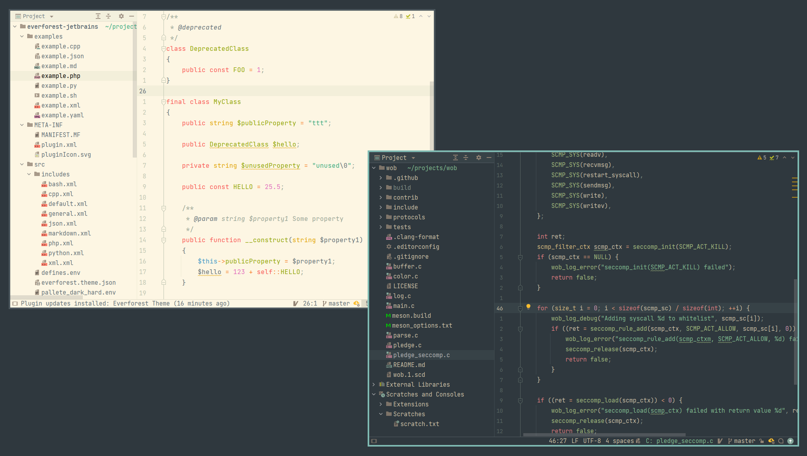

# Everforest JetBrains theme

[](https://github.com/francma/everforest-jetbrains/actions/workflows/test.yml)

The goal of this project is to provide pixel to pixel copy
of [sainnhe/everforest](https://github.com/sainnhe/everforest)
theme for JetBrains based IDEs with sane build system (without Java).



## Current status

Only a few languages are supported. Expect broken syntax highlighting if you don't use language from the list below.

- C
- C++
- JSON
- PHP
- XML
- Bash
- Markdown
- Python
- YAML
- JavaScript

## Installation

### From sources

Install dependencies:

- POSIX shell
- GNU Make
- envsubst (part of GNU gettext)
- zip

All above is most likely already included in base of your Linux distribution.

To build the "everforest.jar" theme, just run:

```shell
make release
```

Go to "Setting > Plugins > Gear icon next to Installed > Install plugin from disk" and locate the "everforest.jar" file.

## Contribution guide

All colors should match to how it looks in neovim with everforest theme selected and
[treesitter](https://github.com/nvim-treesitter/nvim-treesitter) enabled. There are example files for each language
in `examples` folder.

### Adding new language

Start by creating `<language>.xml` inside `src/includes` folder and then find the corresponding XML properties. A good
way to do this is to go to "IDE Settings > Editor > Color Scheme > Your language" and then change all colors to
something that is easy to find (for example change all colors to `#000001`, `#000002` and so on). Now you can click on the
gear icon next to the Theme name and choose export to .icls. Then you can open the .icls file and easily find which XML
value key corresponds to the IDE color setting.

It is required to not use inhered values (by un-ticking the "Inherit values from"), to prevent random breakage when
parent color is changed.